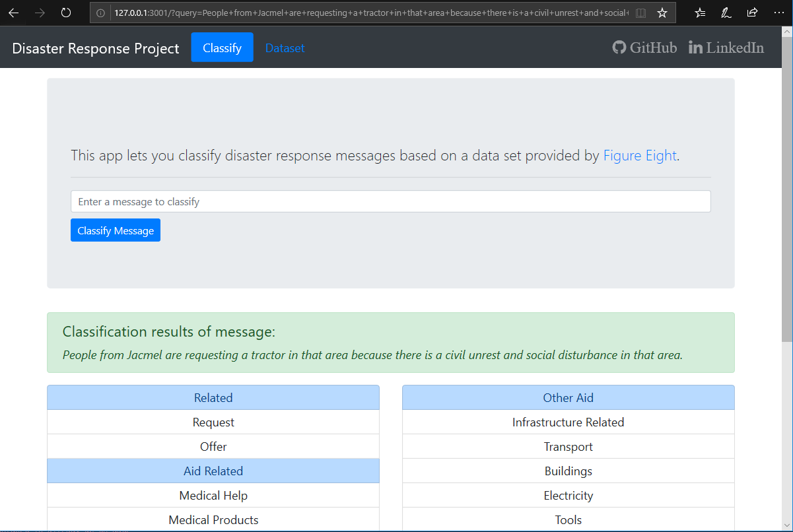

# Disaster Response Pipeline Project

This Project is intended to demonstrate the implementation of an Extract Transform Load (ETL), 
Natural Language Processing (NLP) and Machine Learning (ML) pipeline. A interactive web app
is used to interface the trained model.

The dataset contains real messages that were sent during disaster events. On top of this 
dataset runs a machine learning pipeline to categorize these events so that the web 
application display appropriate disaster relief agencies.

Some ideas on how to take this project further are given in the section [Next Actions](#next_actions).

### Table of Contents

1. [Installation](#installation)
3. [File Descriptions](#files)
4. [Usage](#usage)
5. [Results](#results)
6. [Next Actions](#next_actions)
7. [Licensing, Authors, and Acknowledgements](#licensing)

## Installation and Dependencies
The project is running with Python 3. These libraries are required: 

* numpy
* pandas
* flesk
* fs-ds-util
* sqlalchemy
* sklearn
* nltk
* pickle

To install `fs-ds-util` you can either use
 
	# pip install -i https://test.pypi.org/simple/ fs-ds-util
	
or you can clone the [GitHub repository](https://github.com/fsteppich/fsteppich-datascience-utilities)
and install it locally with

	# git clone  https://github.com/fsteppich/fsteppich-datascience-utilities.git
	# cd fsteppich-datascience-utilities
	# python setup.py sdist
	# pip install --user .

## File Descriptions  
`data/`

Folder containing raw data (.csv-files) used in the initial ETL pipeline to load 
the cleaned messages into a SQLITE database. 

`data exploration/`

Folder containing Jupyter notebooks used to sketch the implemented pipelines.

`workspace/`

Folder containing the source code of all the pipelines (`workspace/preparation/`) 
and the web app (`workspace/app/`). `workspace/data/` is used to store the data 
produced by the pipelines. 

## Usage <a name="usage">
1. Run the following commands in the `workspace/` directory to set up your database and model.

	* To run ETL pipeline that cleans data and loads in database
    
    	~~~~
		    # python preparation/process_data.py ../data/disaster_messages.csv ../data/disaster_categories.csv data/disaster_data.sqlite
        ~~~~
        
    * To run ML pipeline that trains classifier and saves
    
    	~~~~
		    # python preparation/train_classifier.py data/disaster_data.sqlite data/disaster_message_classifier.pickle
        ~~~~

2. Run the following command in the `workspace/app/` directory to start your web application.

	~~~~
	# python run.py ../data/disaster_data.sqlite ../data/disaster_message_classifier.pickle
	~~~~

3. Go to http://localhost:3001/ to use the web application.

	

## Results <a name="results">
Execution of the pipelines was performed on a Lenovo ThinkPad T520 (Intel(R) Core(TM) 
i5-2520M CUP @ 2.50GHz, 16.0GB RAM, Windows 10 Pro x64). 

This section present a brief summery of each pipeline and finishes with the results
found in the training and evaluation phases.

### ETL Pipeline
First I ran a Extract Transform Load (ETL) Pipeline to transform and clean the date. The 
following enumeration sketches the implementation (details can be found in 
`workspace/preparation/process_data.py`).
 
1. The messages and classification categories are provided in two separate .csv-files 
	(`disaster_categories.csv` and `disaster_messages.csv`). These two files needed to be 
	merged on a common `id` column.  
2. The `categories` column contains all the (un)assigned categories in a semicolon joined 
	list of [category]=[1/0] pairs. These needed to be split and transormed into seperate columns.
3. Each value in each new category column gets cleaned. To clean these values I
	1. converted the data type to int,
	2. removed dupplicate messages by `message` and `id` column,
	3. removed some messages with a value of `#NAME?` in the `message` column, and 
	4. mapped any category value besides 0 and 1 to 1 (column `related` contained some 2s)

### NLP Pipeline 
The Natural Language Processing (NLP) Pipeline is part of the ML Pipeline and located in the
file `workspace/preparation/train_classifier.py`. 

This NLP Pipeline performs the following steps:

1. Vectorize a given message 
	1. Replace URLs with placeholder 
	2. Tokenize (Normalize case, remove white spaces and stop word)
	3. Lemmatize (WordNetLemmatizer with Part-of-Speech verb)
2. Transform Bag-of-Words into a Term-Frequency-Inverse-Document-Frequency (Tf-Idf) 
	representation

### ML Pipeline
The Machine Learning (ML) Pipeline takes the cleaned data out of the ETL Pipeline, applies
the NLP Pipeline and a classifier on each of the outputs (categories). The best hyper 
parameters are found with a grid search. 

### Training and Evaluation
I trained a RandomForestClassifier, KNeighborsClassifier and DecisionTreeClassifier (wrapped in 
a MultiOutputClassifier) on 20940 messages with 36 output features. Model evaluation was 
performed on 5236 messages. Hyper parameter selection was performed with grid search and a
2 fold cross validation.

Best scores where gained with the RandomForestClassifier. Averaged evaluation scores are:
 * F1: 0.936
 * Precision: 0.941
 * Recall: 0.948
 * Accuracy: 0.948
 
 KNeighborsClassifier raised a memory error. This classifier performed worst compared to the
 others on smaller sub sets of training and evaluation data. Therefore I did not investigate 
 the training parameters to handle this memory error. 
 
 All the outputs generated by the ML pipeline can be found in the 
 `workspace/data/train_classifier_*.out.txt` files (except for KNeighborsClassifier).

## Next Actions <a name="next_actions">

This project only demonstrates the interaction of the pipelines. To put all this into a 
useful product, one might take these actions: 

* Train model with greater parameter space on a capable hardware to find even better 
	parameters.
* In this dataset are some columns with few message examples like in the category 
	`military` (< 1k) or `clothing` (< 500). This has a negative impact on the performance 
	of the classifier. The classifier will produce outputs that are too closely related 
	to the training data, and may fail to classify future observations reliably.
	To circumvent this issue, one could train the affected category classifiers on a
	balanced subset of the whole training data. 
* Send reports / forward messages to appropriate agencies. Therefor add a set agencies, 
 	report templates, assign each categories based on the agencies area of focus. And add
 	a send mechanism.
* Store new messages in a separate database / table for later post-processing. This is 
	especially relevant if the send feature gets implemented. 
* In addition to the web page build an REST-Service to make this classifier accessible
	by other programs, services. This REST-Service should take a message as input and 
	send a report to an appropriate disaster relief agency.

## Thanks, Authors, Acknowledgements 
Any feedback that helps me to improve this project is welcome.  

This work is licensed under the GNU GPLv3 licence.

My thanks goes to [Udacity](https://www.udacity.com) for providing this insightful project
and to [Figure Eight](https://www.figure-eight.com) for providing the data.

